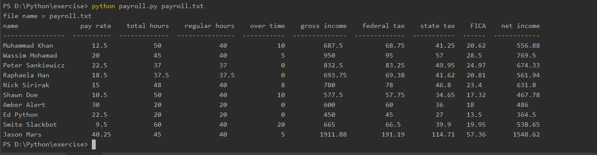

# Final project. 
Students will create a python program to process and tablet a payroll report.
The input data will be the following:

Employee Name; Pay Rate; hours worked. For hours worked over 40 hours employees will earn time and a half. Fed Tax  10%, State tax 6%, FICA 3%

The Output should look the following:
Employee Name    Hours Worked    Pay Rate      Regular Pay    OT Pay    Gross Pay   Fed Tax   State Tax   FICA      Net Pay

The program should run and be able to process 10 employees before ending.

## usage
To run with the command line type "python payroll.py". You will be prompt how many employees for this process, you will then manually enter the name, pay rate, and worked hours for every employee. Finally, it will show the output in a table-like format for everyone.

To process a text file, for example, payroll.txt contains all employees' names, pay rate, and worked hours, Type "python payroll.py payroll.txt"

